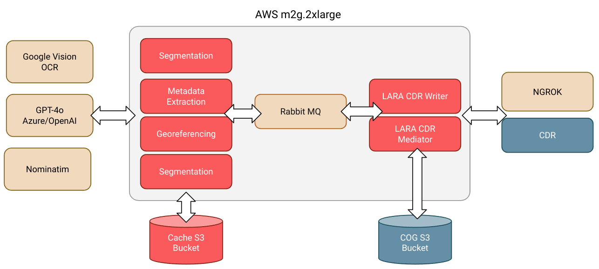

# LARA Stack Deployment



## Pre-requisites
1. A Python 3.10 environment
1. An activated NGROK account and token (see https://ngrok.com/docs/getting-started/)
1. An OpenAI API key or Azure OpenAI API key and endpoint
1. A Google Cloud Vision API JSON key *file* (see https://cloud.google.com/vision/docs/ocr)
1. A CriticalMAAS CDR API key (contact Jataware)
1. A writeable S3 bucket, and its associated credentials

## Setup

Install Jinja-2 CLI:
```console
pip install jinja2-cli
```

Make a copy of the `vars_example.json` file found in this directory and update it with the information specific to your environment.

```console
cp vars_example.json deploy_vars.json
```

The fields that will need to be set are:

* `work_dir`: S3 bucket URL where intermediate pipeline outputs will be cached
* `image_dir`: S3 bucket URL where COGs fetched from the CDR will be cached
* `aws_access_key_id`: The AWS access key ID for the `workdir` anad `imagedir` S3 bucket
* `aws_secret_access_key`: The AWS secret access key for the `workdir` anad `imagedir` S3 bucket
* `cdr_api_token`: A CDR API token string provided by Jataware
* `cdr_host`: URL of the CDR host
* `cog_host`: URL of the COG storage server
* `ngrok_authtoken`: NGROK auth token string
* `llm_provider`:  set to `azure` or `openai` based on the desired LLM host - defaults to `openai`
* `llm`: the model identification string - defaults to `gpt-4o`, valid options are determined by the model provider
* `azure_openai_api_key`: Azure OpenAI API key string - used when `llm_provider` is set to `azure`
* `azure_openai_endpoint`: The endpoint of the Azure OpenAI service - used when `llm_provider` is set to `azure`
* `openai_api_key`: OpenAI API key for OpenAI's hosted service (only needed if not using Azure) - used when `llm_provider` is set to `openai` (default)
* `google_application_credentials_dir`: A path pointing to the **directory** containing the Google Cloud Vision API JSON key **file**. ⚠️ **NOTE:** This file MUST be named `google_application_credentials.json`.⚠️
* `tag`: The docker tag of the LARA images to deploy (ie. `latest`)
* `gpu`: A boolean indicating whether or not the system should attempt to use GPU resources if available.

Next, generate a docker compose file from your variables:
```console
./gen_compose.sh deploy_vars.json
```

This should create a new `docker-compose.yml` file with values derived from the `deploy_var.json` file.  The compose file can be copied to an intended deployment environment such as an AWS EC2 node.

LARA containers can be pulled by running:
```console
docker compose pull
```

The system can be started in detached mode by running:
```console
docker compose up -d
```

and stopped by running:
```console
docker compose stop
```

Logs are available through:
```console
docker compose logs -f
```

Once running, the system will respond to maps by being added to the CDR by executing the LARA pipelines and uploading results.  This can be triggered through the CriticalMAAS Polymer HMI by selecting a map and clicking the "Process Map" button.  Logs will display processing progress.

## Deployment Recommendations

The system has been tested on an AWS `m7g.2xlarge node` (32GB RAM, 8x vCPU, NO GPU), which results in processing times of 2-3 minutes per individual map.  A node with 16GB of RAM was tested, but larger maps failed to process due to out-of-memory errors.

The S3 bucket used for the `workdir` and `imagedir` storage should have an expiry period set (24 hrs. recommended).  The data stored during processing is not needed after results are written to the CDR, but the application **does not** clean up these files itself.

